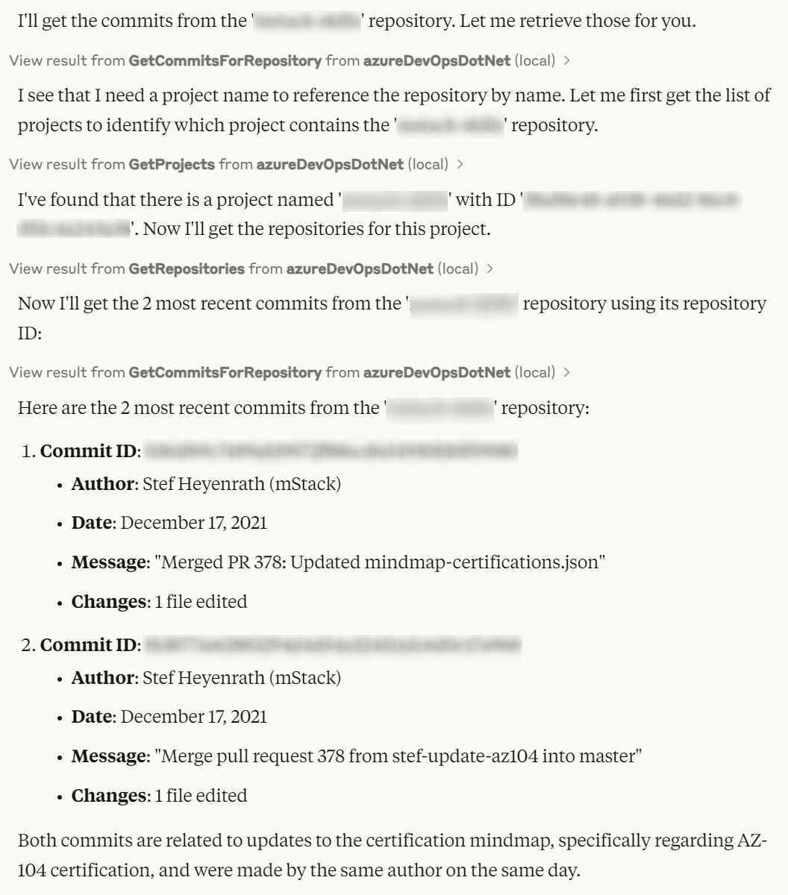

# mcpserver.azuredevops
A Stdio MCP server as dotnet tool to access Azure DevOps.

## 📦 NuGet
[](https://www.nuget.org/packages/mcpserver.azuredevops.stdio)

### Installation
``` cmd
dotnet tool install --global mcpserver.azuredevops.stdio
```

<br>

## 🛠️ Supported Tools

### Core Navigation Tools
- `GetProjects`: List all accessible projects
- `GetRepositories`: List all repositories in a project


### Project Tools
- `GetProject`: Get details of a specific project


### Repository Tools
- `GetRepository`: Get repository details


### Work Item Tools

- `get_work_item`: Retrieve a work item by ID
- `create_work_item`: Create a new work item
- `update_work_item`: Update an existing work item
- `list_work_items`: List work items in a project
- `manage_work_item_link`: Add, remove, or update links between work items


### Search Tools
- `search_code`: Search for code across repositories in a project


### Git Tools
- `GetCommit`
- `GetCommitsForRepository`


<br>

## 💡 LLM Examples

### Semantic Kernel
This MCP Server can be used in [ModelContextProtocol-SemanticKernel](https://github.com/StefH/McpDotNet.Extensions.SemanticKernel).

#### Question
``` raw
Get 5 commits from the repository '. . .'
```

#### Answer
``` raw
Here are the 3 most recent commits from the '. . .' repository:

1. **Commit ID:** [. . .](https://dev.azure.com/. . ./. . ./_git/. . ./commit/. . .)
   - **Author:** Stef Heyenrath
   - **Date:** 2021-12-17
   - **Comment:** Merged PR 378: Updated mindmap-certifications.json

2. **Commit ID:** [. . .](https://dev.azure.com/. . ./. . ./_git/. . ./commit/. . .)
   - **Author:** Stef Heyenrath
   - **Date:** 2021-12-17
   - **Comment:** Merge pull request 378 from stef-update-az104 into master

3. **Commit ID:** [. . .](https://dev.azure.com/. . ./. . ./_git/. . ./commit/. . .)
   - **Author:** Stef Heyenrath
   - **Date:** 2021-12-17
   - **Comment:** 103

If you need more details about any specific commit, feel free to ask!
```

### Claude Desktop
This MCP Server can also be used in Claude Desktop.

#### Config
``` json
{
    "mcpServers": {
        "azureDevOpsDotNet": {
            "command": "mcpserver.azuredevops.stdio",
            "args": [ ],
            "env": {
                "AZURE_DEVOPS_ORG_URL": "https://dev.azure.com/. . .",
                "AZURE_DEVOPS_AUTH_METHOD": "pat",
                "AZURE_DEVOPS_PAT": ". . .",
                "AZURE_DEVOPS_DEFAULT_PROJECT": "AzureExampleProjects"
            }
        }
    }
}
```

#### Question
Get 2 commits from the azure devops repository '. . .'.

#### Answer

